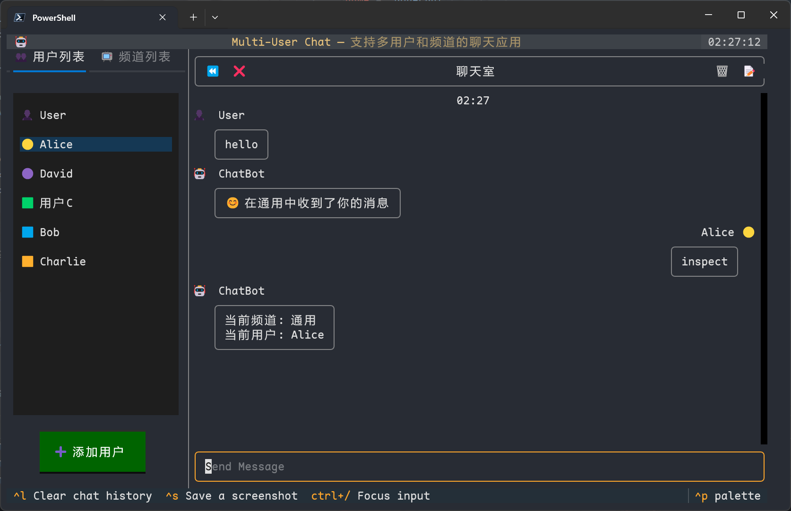

# Nonechat

通用控制台聊天界面

## 使用

```python
from nonechat.info import Event
from nonechat.app import Frontend
from nonechat.backend import Backend


class ExampleBackend(Backend):

    def on_console_load(self):
        print("on_console_load")

    def on_console_mount(self):
        print("on_console_mount")

    def on_console_unmount(self):
        print("on_console_unmount")

    async def post_event(self, event: Event):
        print("post_event")


app = Frontend(ExampleBackend)
app.run()
```

## 预览


